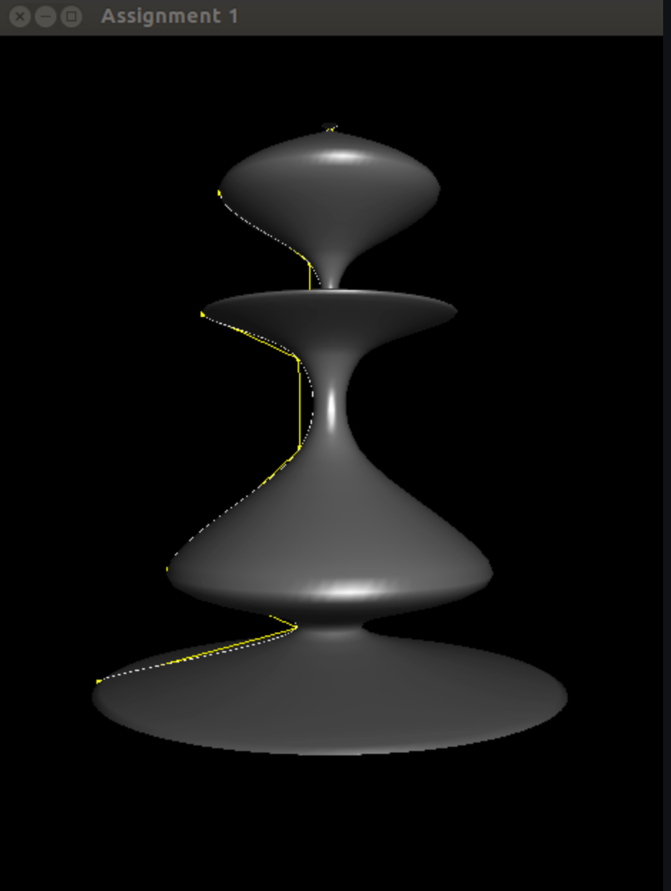

# Using OpenGL 

### Name: Raja Ravindra Kathi

### Collaboration: 
None for now!

### References:
- https://www.youtube.com/watch?v=CpEfHhSpQrw&ab_channel=Kh%C3%A1nhNguy%E1%BB%85n
- AI Chatbots to understand concepts and existing code

### Known Problems: 
No problems, works with all features as asked.

### Comments: 
Maybe I could implement techniques more in statically typed languages but in this i am half time second guessing logic vs syntax all that loop.

### To run:
Same like given solution pass the swap file

## Screenshots:

- First artifact, got this online from reddit forum - I call it vortex

- Second artifact, got this from same reddit thread - its a chess piece.

